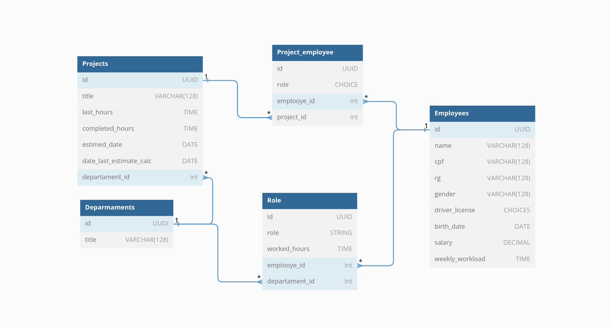

<h1 align= "center">
    EMS (Enterprise Management System)
</h1>

<h3 align= "center">
    Sistema de Gerenciamento Empresarial
</h3>


O Sistema de Gerenciamento Empresarial é uma aplicação que foi desenvolvida com o objetivo de atender às necessidades de gestão de uma empresa. Ele consiste em duas partes, uma que utiliza o MySQL como banco de dados e outra que utiliza o Python e o Django para a criação de uma API Rest.

Para garantir uma maior compatibilidade, as duas partes foram implementadas em contêineres Docker, seguindo as melhores práticas de desenvolvimento de software. Além disso, também foram desenvolvidos testes para garantir a qualidade e integridade do código.


<h3 align= "center">
  Documentação&nbsp;&nbsp;&nbsp;&nbsp;&nbsp;&nbsp;
</h3>

As informações sobre os endpoints e opções da aplicação podem ser encontradas no link da documentação:


https://pvitor7.github.io/EMS---Documentation/#req_e62af1d175ce40628ac3af1e2af79dff


<h4 align= "center">
  Sobre a aplicação
</h4>

####

Um usuário pode se cadastrar no sistema, e após realizar o login poderá cadastrar, editar e excluir os departamentos, projetos e funcionários.
Os funcionários podem ser associados ou removidos aos departamentos e projetos.

Cada projeto possui uma estimativa de carga horária, e quando um funcionário é associado ao projeto, são computadas 8h realizadas a cada dia passado (antes do dia atual), de acordo com o número de funcionários.

Os funcionários podem ser associados aos projetos desde que o seu acumulo de horas não ultrapasse sua carga horária semanal, que são definidas no cadastro do funcionário.


<blockquote align="center"></blockquote>

<h3 align= "center">
  Tecnologias&nbsp;&nbsp;&nbsp;&nbsp;&nbsp;&nbsp;
</h3>

<p align="center" >
  As tecnologias utilizadas no projeto foram: Python | Mysql | Django | Django Rest Framework | Docker | Docker-compose .
</p>
<br/>


<h4 align= "center">
  Relacionamentos&nbsp;&nbsp;&nbsp;&nbsp;&nbsp;&nbsp;
</h4>


<br/>

<h3 align= "center">
    Instalação e execução
<h3 align= "center">


##### 1. Clone este repositório em sua máquina local.

```
    git@github.com:pvitor7/EMS-Enterprise-Management-System.git
```

##### 2. Acesse a pasta do projeto.

```
    cd EMS-Enterprise-Management-System
```

##### 3. Crie um ambiente e o use para execução (Linux).

```
    python -m venv venv
```
```
    source venv/bin/activate
```

##### 4. Instale as dependências do projeto.

```
    pip install -r requirements.txt
```

##### 5. Variáveis de Ambiente

Dentro do  o projeto  crie um arquivo **.env**, copiando o formato do arquivo **.env.example**  e preencha com as configurações do banco de dados:

```
    cp .env.example .env
```

##### 6. Rode o projeto.
Após o preenchimento das variáveis de ambiente, execute o seguinte comando.

***- OBS: o Docker utilizará por padrão a porta 3306 para o MySql, e pro Django a porta 8000, é importante garantir que ambas estejam disponíveis para a execução docker-compose.***
  
```
    docker compose up
```

Ele cria os containers necessários para a execução do projeto, que estará disponível na porta 8000 no endereço: http://localhost:8000/.


##### 7. Testes.
A aplicação também conta com testes (em desenvolvimento), que podem ser executados com o seguinte comando:

```
./manage.py test 
```
<br/>